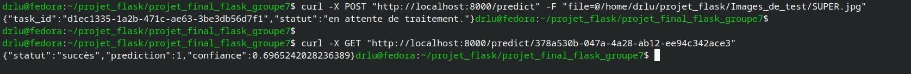
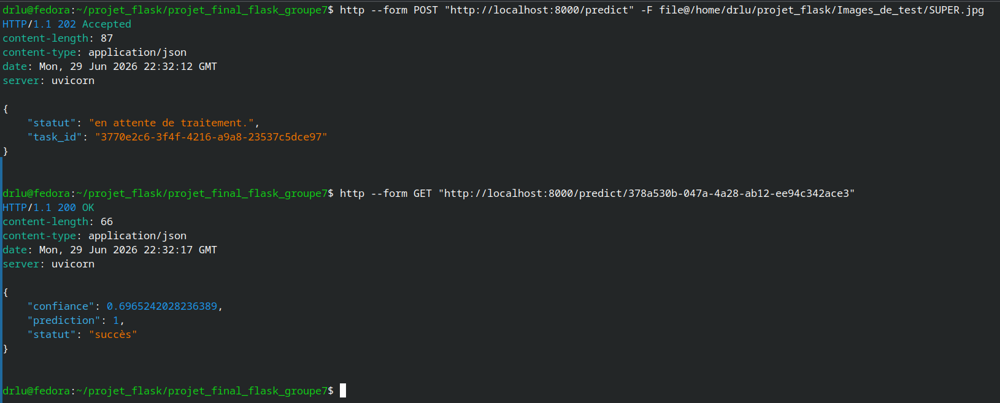
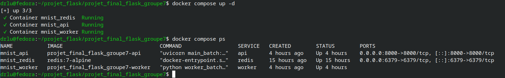
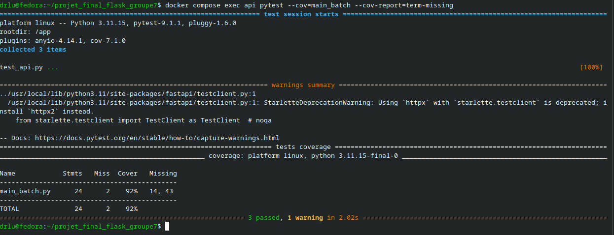
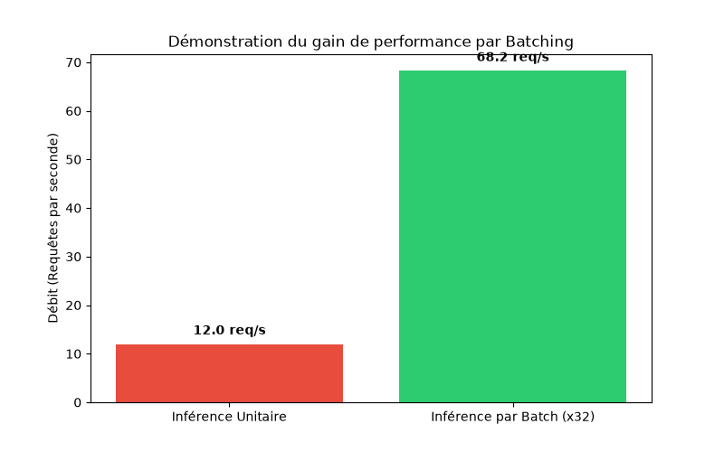

# Système de Prédiction MNIST Distribué avec Dynamic Batching

Ce projet implémente une architecture asynchrone et distribuée pour la prédiction de chiffres manuscrits (Dataset MNIST) à l'aide de **FastAPI**, **Redis** et **PyTorch**. L'objectif principal est d'optimiser le débit du serveur de Deep Learning sur CPU en regroupant dynamiquement les requêtes entrantes par lots (**Dynamic Batching**).

## Architecture du Système

Le projet utilise une architecture orientée événements découpée en trois microservices conteneurisés :

1. **API Gateway (FastAPI)** : Réceptionne les images envoyées par les utilisateurs, génère un identifiant unique (UUID), pousse la tâche dans la file d'attente Redis et attend le résultat de manière non bloquante.
2. **Message Broker & Data Store (Redis)** : Gère la file d'attente des tâches (`image_queue`) et stocke temporairement les résultats des prédictions.
3. **Batch Worker (PyTorch)** : Surveille la file d'attente, regroupe dynamiquement les images disponibles sous forme de lot (batch), exécute la prédiction sur le modèle CNN (Convolutional Neural Network) et renvoie les résultats dans Redis.

## Structure du Projet

```text
📂 projet_final_flask_groupe7/
├── 📂 images/                     # Graphiques de performance générés
├── 📂 modele/                     # Dossier du modèle entraîné
│   └── mnist_cnn.pth             # Poids du modèle PyTorch CNN
├── 📄 docker-compose.yml         # Chef d'orchestre des conteneurs
├── 📄 Dockerfile                 # Recette de build pour l'API et le Worker
├── 📄 requirements.txt           # Dépendances Python du projet
├── 📄 main_batch.py              # Code source de l'API FastAPI
├── 📄 worker_batch.py            # Code source du Worker PyTorch
├── 📄 train.py                   # Script d'entraînement du modèle CNN
└── 📄 benchmark.py               # Script de test de charge (100 requêtes)
```

## Captures

### curl POST/GET


### http POST/GET


### processus docker compose


### Test automatise avec pytest (92%)


### Prédiction unitaire vs prédiction par lot
